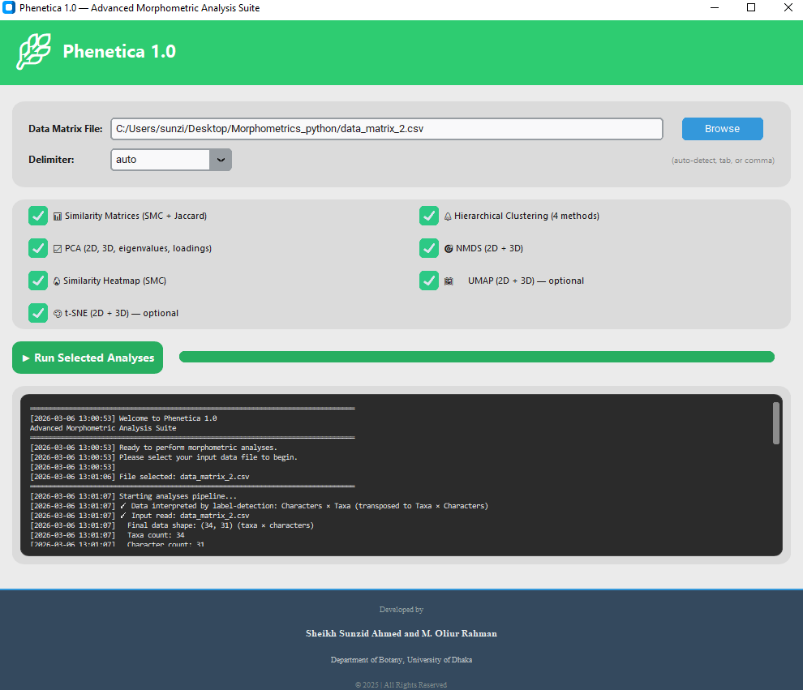
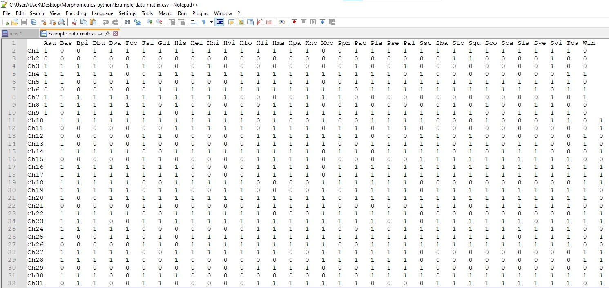

# **Phenetica v.1.0**
Phenetica is a powerful, cross-platform, standalone desktop application designed for comprehensive morphometric analysis of biological data using binary character traits. Built with modern Python technologies, Phenetica provides taxonomists and researchers with an intuitive graphical interface for performing advanced statistical analyses without the need for programming knowledge.

## **Why Phenetica?**
Phenetica bridges the gap between complex statistical methods and practical biological research, making sophisticated morphometric analyses accessible to everyone. The key features include:
1. **Cost-Free & Open Source** — No licensing fees, freely available for academic and research use.
2. **Cross-Platform** — Runs seamlessly on Windows (10, 11) and Linux systems.
3. **User-Friendly** — Modern GUI with no coding required.
4. **Comprehensive** — Multiple analysis methods in one integrated tool.
5. **Publication-Ready** — High-quality visualizations suitable for scientific publications.
6. **Efficient** — Automated workflow from data input to results generation.

## **✨ Features**

📊**Similarity Analysis**
1. Simple Matching Coefficient (SMC) — Quantifies overall similarity between taxa.
2. Jaccard Similarity Index — Measures similarity based on shared presence of characters.
3. Exports similarity matrices in CSV format for further analysis.

🌳**Hierarchical Clustering**
1. UPGMA Dendrogram — Unweighted Pair Group Method with Arithmetic Mean (average linkage).
2. Alternative Clustering Methods — Single linkage, complete linkage, and Ward's method.
3. Publication-quality dendrograms.
4. Automatic label sizing based on dataset complexity.

📈**Ordination Methods**
1. Principal Component Analysis (PCA).
2. Non-metric Multidimensional Scaling (NMDS).
3. UMAP (Uniform Manifold Approximation and Projection).
4. t-SNE (t-Distributed Stochastic Neighbor Embedding).

🔥**Data Visualization**
1. Similarity Heatmap — Color-coded matrix showing relationships between all taxa.
2. Scatter Plots — Labeled data points with distinct colors per analysis.
3. Dendrograms — Multiple clustering visualizations with adjustable aesthetics.

💾**Output Management**
1. All results saved in organized outputs/ folder.
2. CSV files for numerical results (matrices, eigenvalues, loadings, clusters).
3. PNG files for all visualizations.

## Installation

### **Windows**

Recommended OS: Windows 10/11

Please download the EXE file from the link below, double-click, and enjoy!

Alternate download link (Google Drive): https://drive.google.com/file/d/154A28cVQbkoDNp5RVFpFCVqXAfR0gjDn/view?usp=sharing

### **Linux**

Before beginning, download the full repository from GitHub by clicking the green Code button and selecting Download ZIP. After the download is complete, extract the ZIP file to a location of your choice—moving it to your home directory is recommended for convenience. Once extracted, open a terminal and navigate to the project folder. From there, you can begin the setup by first installing Conda (if it’s not already installed), then creating a dedicated environment and installing the necessary dependencies by executing the commands as outlined below.

1. `conda create -n phenetica python=3.9`
2. `conda activate phenetica`
3. `conda install numpy pandas matplotlib seaborn scipy scikit-learn`
4. `pip install umap-learn`
5. `python Phenetica_1.0.py`

After successful installation and execution, the GUI will appear as outlined below:

<p align="center">
  
</p>

## Input Structure
Phenetica accepts a CSV file containing morphological or binary trait data. Each row represents a character, and each column represents a taxon.

A binary data matrix is needed that can be prepared from contrasting characters for the selected species. An example is given below with species (in the column) and characters (in the row):


**Character encoding**


```
Species						
Characters	F. colorata	F. simplex	H. fomes	H. littoralis	H. macrophylla	H. papilio
Habit (Tree, Shrub (1)/Herb, Climber(0))	Tree	Tree	Tree	Tree	Tree	Tree
Leaf (Simple (0)/Compound (1))	Simple	Simple	Simple	Simple	Simple	Simple
Leaf lobe  (Present (1)/Absent (0))	Present	Present	Absent	Absent	Absent	Absent

```

**Software input**

After encoding the contrasting characters into binary states, a CSV file should be prepared for uploading into Phenetica. For more information, please check the Example_data_matrix (CSV) files in the main repository.

With proper preparation, the input file might look like below after opening in Notepad:


<p align="center">
  
</p>


**Analysis Options**
1. After uploading your CSV, please select one or multiple analyses using the provided checkboxes.
2. Click on the **“Run selected analyses”** button to execute all chosen analyses in a single step.

## License
This project is licensed under the MIT license.

## Developers
Sheikh Sunzid Ahmed & M. Oliur Rahman.

Plant Taxonomy and Ethnobotany Laboratory, Department of Botany, University of Dhaka.

## Contact
If you have any questions, feedback, or issues, please don't hesitate to contact us at-

oliur.bot@du.ac.bd || sunzid79@gmail.com
